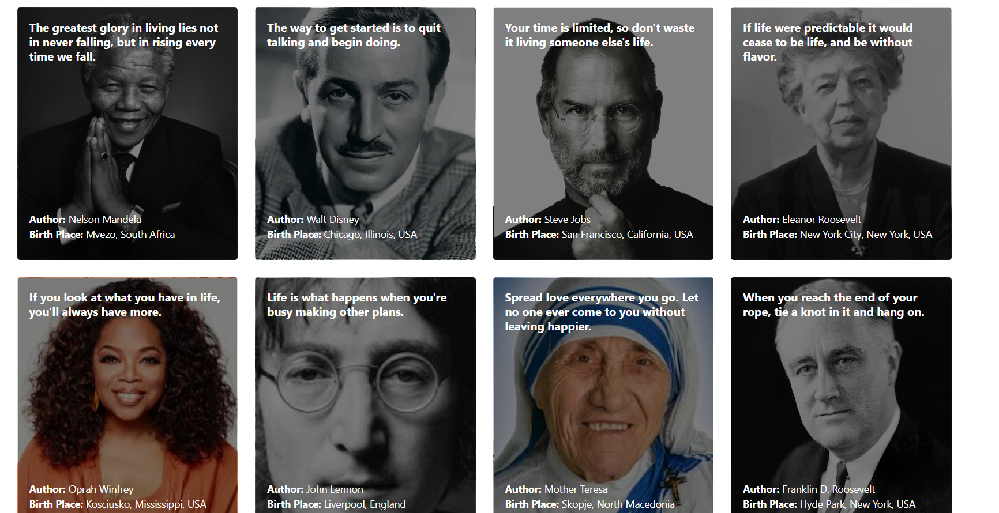

Quotes Application

Project Overview

This project demonstrates how to create a simple card UI component using HTML and CSS. The card includes a customizable background image, a title, and a description.

Features
Responsive card design.
Customizable background image using the background-image CSS property.
Modern design with shadows, rounded corners, and centered alignment.

;